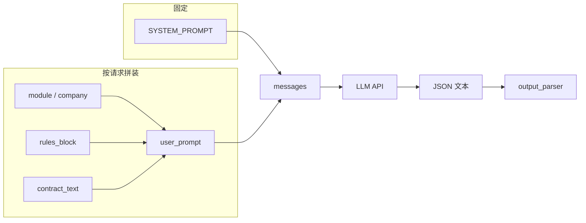

# 提示词框架设计

> **说明**：合同评审 Agent 的提示词如何组织。实现入口：`backend/app/services/agent.py`（`SYSTEM_PROMPT`、`USER_PROMPT_TEMPLATE`、`_format_rules_block`）。

---

## 目录

| # | 章节 |
|---|------|
| 1 | [消息结构](#1-消息结构) |
| 2 | [System Prompt](#2-system-prompt) |
| 3 | [User Prompt](#3-user-prompt) |
| 4 | [规则块 rules_block](#4-规则块-rules_block) |
| 5 | [输出约定（JSON）](#5-输出约定json) |
| 6 | [推理参数](#6-推理参数) |
| 7 | [小结与扩展](#7-小结与扩展) |
| — | [相关文件](#相关文件) |

---

## 1. 消息结构

### 1.1 两段式请求

每次调用使用 **OpenAI 兼容 Chat Completions**，仅两条消息：

| 角色 | 变量 | 是否固定 | 说明 |
|:--|:--|:--:|:--|
| `system` | `SYSTEM_PROMPT` | 是 | 与模块、合同无关的全局协议 |
| `user` | `USER_PROMPT_TEMPLATE.format(...)` | 否 | 模块名、产业公司、`rules_block`、合同正文（可为切片） |

### 1.2 代码对应

```python
# backend/app/services/agent.py
messages = [
    {"role": "system", "content": SYSTEM_PROMPT},
    {"role": "user", "content": user_prompt},
]
```

### 1.3 数据流（概览）



---

## 2. System Prompt

`SYSTEM_PROMPT` **不**包含具体业务规则与合同全文，只承载**长期有效的行为协议**。

### 2.1 内容分块

| 块 | 要点 |
|:--|:--|
| **角色与任务** | 中国区销售合同评审专家；按规则逐项审查；结构化报告 |
| **立场与术语** | 我方 = 乙方/卖方；甲乙方默认映射；冲突以合同定义为准；结论从我方视角 |
| **能力边界** | 不臆测；模糊标「待确认」；无外部系统则「需人工核验」 |
| **核心原则** | 先识别后判定；`identify` / `judge` / `verify`；原文零改写；一规则一条 JSON；`evidence_spans` / `{{id:}}` 防漏证 |
| **段落编号** | 输入 `<!-- N -->`；输出 `paragraph_*`；`risk_description` 中 `{{id:X}}` 等与解析器、前端一致 |
| **通用约束** | 防幻觉；目录/表格不作风险引用依据；`\|` → `/`；全中文 |

### 2.2 设计意图

> 所有模块共用的「世界观 + 输出协议 + 证据格式」集中在 **system**，减少 **user** 重复，避免各模块各写一套矛盾说明。

---

## 3. User Prompt

由 `USER_PROMPT_TEMPLATE` 拼成，正文用 Markdown 分段组织。

### 3.1 骨架

| 章节（模板内） | 占位 / 含义 |
|:--|:--|
| 开篇 | `【{module}】` 模块评审 |
| **合同信息** | `产业公司：{company}` |
| **评审规则** | `{rules_block}` ← `_format_rules_block(rules)` |
| **合同文本** | `{contract_text}`（整份或 **chunk**） |
| **输出要求** | JSON 数组 + 各字段说明 |

### 3.2 文本结构示意

```text
请对以下销售合同进行【{module}】模块的评审。

## 合同信息
- 产业公司：{company}

## 评审规则
{rules_block}

## 合同文本（段落编号格式为 <!-- N -->）
{contract_text}

## 输出要求
（纯 JSON 数组，字段列表…）
```

### 3.3 设计意图

| 部分 | 作用 |
|:--|:--|
| 模块 / 公司 | 对齐 `get_rules_by_module` 的筛选语境 |
| 规则块 | 结构化规则 → 模型可读指令 |
| 合同正文 | 与规则解耦，切片时只替换本段 |
| 输出要求 | 与 `AuditRecord`、`output_parser` 对齐，约束 JSON 形状 |

---

## 4. 规则块 `rules_block`

`_format_rules_block` 将 `list[RuleCreate]` 展开为伪 Markdown 文本。

### 4.1 单条规则模板

| 行 | 来源字段 |
|:--|:--|
| `### 规则 {rule_id}：{review_point}` | 标识与评审点 |
| `- 评审类型：{review_type}` | `identify` / `judge` / `verify` |
| `- 提取指令：` … | `extraction_instruction` |
| `- 风险判定条件：` … | `risk_criteria`（若有） |
| `- 风险排除/豁免：` … | `risk_exclusion`（若有） |
| `- 备注：` … | `notes`（若有） |

多条规则之间以空行分隔。

### 4.2 数据源

| 路径 | 内容 |
|:--|:--|
| `backend/app/data/rules_data.py` | `BUILTIN_RULES`、`MODULES`、`get_rules_by_module` |

### 4.3 设计意图

> 规则以代码中的结构化字段为**唯一事实来源**；Prompt 侧只做展开，**不**维护第二套自然语言规则库。

---

## 5. 输出约定（JSON）

User 末尾 **## 输出要求** 与后端契约对齐。

### 5.1 顶层形态

| 要求 | 说明 |
|:--|:--|
| 根类型 | **JSON 数组** |
| 元素 | **每个评审点（规则）一个对象** |
| 包裹 | 不要 markdown 代码块；不要额外说明文字 |

### 5.2 主要字段（与 `AuditRecord` 对应）

| 字段 | 说明 |
|:--|:--|
| `rule_id` | 规则编号 |
| `review_point` | 评审点名称 |
| `review_type` | `identify` / `judge` / `verify` |
| `paragraph_start` / `paragraph_end` | 段落编号；未找到为 `"未找到"` |
| `contract_quote` | 原文引用（`\|` → `/`） |
| `evidence_spans` | 证据段落数组（可多项） |
| `extracted_info` | 结构化提取结果 |
| `risk_level` | `risk` / `no_risk` / `needs_manual_review` / `not_applicable` |
| `risk_description` | 结论文本；可含 `{{id:X}}` |
| `suggestion` | 修改建议 |

### 5.3 Python `.format()` 与花括号

若模板中需向模型输出字面量 **`{{id:X}}`**，在 Python 字符串里应写成 **`{{{{id:X}}}}`**，经 `.format()` 后变为发给模型的 `{{id:X}}`。

### 5.4 设计意图

> **输出要求** = 前后端的「接口说明」，与 `output_parser`、`schemas.AuditRecord` 一致，降低解析失败率。

---

## 6. 推理参数

| 参数 / 逻辑 | 作用 |
|:--|:--|
| `temperature=0.0` | 输出更稳定、可复现 |
| `max_tokens=8192` | 为长 JSON 预留输出长度 |
| `finish_reason == "length"` 时重试 | 缓解截断（见 `run_module_audit_sync`） |

---

## 7. 小结与扩展

| 层 | 含义 |
|:--|:--|
| **System** | 评审「宪法」：立场、任务类型、证据与段落协议、防幻觉 |
| **User** | 当次任务书：模块、公司、规则列表、合同片段、JSON字段说明 |
| **规则数据** | `RuleCreate` → `_format_rules_block` → 注入 User |

**扩展建议**：新增「行业」「合同类型」等上下文时，优先在 **User 模板**增一节，或在 **System** 增一条全局约束；**具体规则条文**仍放在 `rules_data.py`，避免写死在 System 长文中。

---

## 相关文件

| 文件 | 职责 |
|:--|:--|
| `backend/app/services/agent.py` | System/User 模板、拼装、调用 LLM |
| `backend/app/data/rules_data.py` | 内置规则、`MODULES`、按模块/公司筛选 |
| `backend/app/services/output_parser.py` | LLM 输出 → `AuditRecord` |
| `backend/app/models/schemas.py` | `RuleCreate`、`AuditRecord` 定义 |
